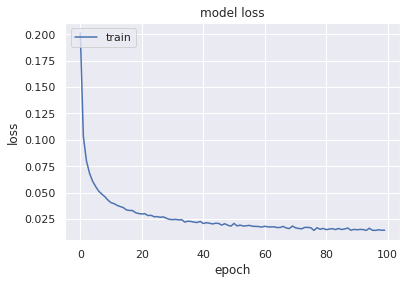
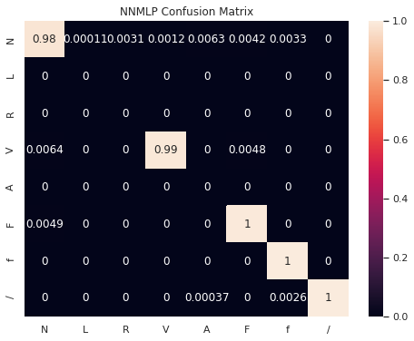
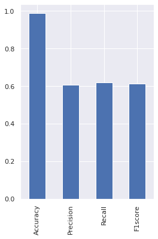
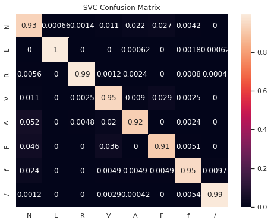
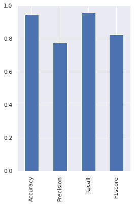

# Classification of beats using MLP and SVC models and beat holdout method


```python
# Imports:
import numpy as np
import pickle
import glob
import matplotlib.pyplot as plt
import pandas as pd
import os
import seaborn as sns
from sklearn.metrics import *
import tensorflow as tf
from tensorflow.keras.utils import to_categorical
from tensorflow.keras.models import Sequential
from tensorflow.keras.layers import Dense
sns.set()

length = 277
```

### Load the holdout beats data and one-hot encode the heart beat classes


```python
# Load the training and testing data:
train_values = np.empty(shape=[0, length])
test_values = np.empty(shape=[0, length])

train_beats = glob.glob('../../training_data/train_beats.csv')
test_beats = glob.glob('../../testing_data/test_beats.csv')

for j in train_beats:
    print('Loading ', j)
    csvrows = np.loadtxt(j, delimiter=',')
    train_values = np.append(train_values, csvrows, axis=0)

for j in test_beats:
    print('Loading ', j)
    csvrows = np.loadtxt(j, delimiter=',')
    test_values = np.append(test_values, csvrows, axis=0)
    
print(train_values.shape)
print(test_values.shape)

# Separate the training and testing data, and one-hot encode Y:
X_train = train_values[:,:-2]
X_test = test_values[:,:-2]
y_train = train_values[:,-2]
y_test = test_values[:,-2]

# One-hot encode Y:
y_train1 = to_categorical(y_train)
y_test1 = to_categorical(y_test)
```

    Loading  ../training_data/train_beats.csv
    Loading  ../testing_data/test_beats.csv
    (31864, 277)
    (37863, 277)


### Create show results function


```python
def showResults(test, pred, model_name):
    accuracy = accuracy_score(test, pred)
    precision= precision_score(test, pred, average='macro')
    recall = recall_score(test, pred, average = 'macro')
    f1score= f1_score(test, pred, average='macro') 
    print("Accuracy  : {}".format(accuracy))
    print("Precision : {}".format(precision))
    print("Recall : {}".format(recall))
    print("f1score : {}".format(f1score))
    cm=confusion_matrix(test, pred, labels=[1,2,3,4,5,6,7,8])
    return (model_name, round(accuracy,3), round(precision,3) , round(recall,3) , round(f1score,3), cm)
```

### Build the multi-layer perceptron architecture and train the model


```python
# Build a multi-layer perceptron:
def getModel():
    mlpmodel = Sequential()
    mlpmodel.add(Dense(100, activation = 'relu'))
    mlpmodel.add(Dense(9, activation = 'softmax'))
    return mlpmodel
```


```python
mlpmodel = getModel()
mlpmodel.compile(optimizer = 'adam', loss = tf.keras.losses.CategoricalCrossentropy())
mlphistory = mlpmodel.fit(X_train, y_train1, epochs = 100, verbose = 0)
```

    Time Taken = 382.79593563079834


### NNMLP Performance Metrics


```python
# Performance metrics
pred = mlpmodel.predict(X_test)
nnmlp_results = showResults(np.argmax(y_test1, axis = 1), np.argmax(pred, axis = 1), 'NNMLP')
```

    Accuracy  : 0.9567915907350184
    Precision : 0.792924906447206
    Recall : 0.9488391598682535
    f1score : 0.8515479582244831


```python
plt.plot(mlphistory.history['loss'])
plt.title('model loss')
plt.ylabel('loss')
plt.xlabel('epoch')
plt.legend(['train', 'val'], loc='upper left')
plt.show()
```





```python
# performance metrics

categories=['N','L','R','V','A','F','f','/']

plt.figure(figsize=(8,6))

cm = confusion_matrix(np.argmax(y_test1, axis = 1), np.argmax(pred, axis = 1), normalize='true')
sns.heatmap(cm, annot=True, xticklabels=categories, yticklabels=categories)
plt.title('NNMLP Confusion Matrix')

plt.show()
```





```python
# performance metrics
NNMLP_results = pd.DataFrame(data=(nnmlp_results),index=('Model','Accuracy','Precision','Recall','F1score','CM'))
plt.figure(figsize=(4,6))
NNMLP_results[0][1:5].plot(kind='bar')
plt.show()
```





### Save NNMLP model, model weights and results


```python
if not os.path.exists('../model_weights/'):
    os.mkdir('../model_weights')
mlpmodel.save('../model_weights/NNMLP_model_beats')

if not os.path.exists('../model_results/'):
    os.mkdir('../model_results')
NNMLP_results.to_csv('../model_results/nnmlp_beats_results.csv', encoding='utf-8', index=False)
```

    WARNING:tensorflow:From /opt/conda/lib/python3.7/site-packages/tensorflow_core/python/ops/resource_variable_ops.py:1786: calling BaseResourceVariable.__init__ (from tensorflow.python.ops.resource_variable_ops) with constraint is deprecated and will be removed in a future version.
    Instructions for updating:
    If using Keras pass *_constraint arguments to layers.
    INFO:tensorflow:Assets written to: ../model_weights/NNMLP_model_beats/assets


### Initialize and train an SVC model


```python
#support vector classifier
from sklearn.pipeline import make_pipeline
from sklearn.preprocessing import StandardScaler
from sklearn.svm import SVC

svc_clf = make_pipeline(StandardScaler(), SVC(gamma='auto'))
svc_clf.fit(X_train, y_train)
print('Support Vector Results')
y_pred_svc = svc_clf.predict(X_test)
print(svc_clf.score(X_test,y_test))
```

    Support Vector Results
    0.944087895834984
    Time taken = 281.56352376937866


### SVC Performance metrics


```python
# performance metrics
svc_results = showResults(y_test, y_pred_svc,'SVC')
```

    Accuracy  : 0.944087895834984
    Precision : 0.7729722935290856
    Recall : 0.9552709075174075
    f1score : 0.8243792724320694


```python
# performance metrics
categories=['N','L','R','V','A','F','f','/']

plt.figure(figsize=(8,6))

cm = confusion_matrix(y_test, y_pred_svc, normalize='true')
sns.heatmap(cm, annot=True, xticklabels=categories, yticklabels=categories)
plt.title('SVC Confusion Matrix')

plt.show()
```





```python
# performance metrics
SVC_results = pd.DataFrame(data=(svc_results),index=('Model','Accuracy','Precision','Recall','F1score','CM'))
plt.figure(figsize=(4,6))
SVC_results[0][1:5].plot(kind='bar')
plt.show()
```





### Save SVC model, model weights and results


```python
# Save to file in the current working directory
pkl_svc = "../model_weights/SVC_model_beats.pkl"
with open(pkl_svc, 'wb') as file:
    pickle.dump(svc_clf, file)

# Load from file
# with open(pkl_svc, 'rb') as file:
#     pickle_svc = pickle.load(file)

print(SVC_results)
SVC_results.to_csv('../model_results/svc_beats_results.csv', encoding='utf-8', index=False)
```

                                                               0
    Model                                                    SVC
    Accuracy                                               0.944
    Precision                                              0.773
    Recall                                                 0.955
    F1score                                                0.824
    CM         [[26772, 19, 40, 310, 643, 761, 120, 0], [0, 1...

